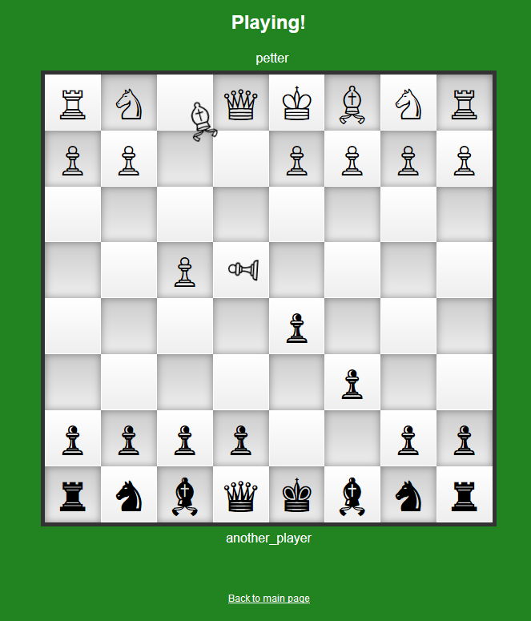

This is a project where I explore things that are new to me (asyncio, ES6 modules, Selenium, pytest-cov, …).

# Real-time Chess
In **Real-time Chess** (or [**Kung-Fu Chess**](https://en.wikipedia.org/wiki/Kung-Fu_Chess), **Ninja Chess**), all pieces can be moved simultaneously, but there is a short cool-down afterwards. This is a very fun multi-player game, completely different from regular chess!

This repository contains a Python server that hosts real-time Chess games.
There is a test server running intermittently at [chess.strandmark.net](https://chess.strandmark.net).

## Requirements
Python 3.5+ and asyncio, jinja2, pytest. 

If you want to run the server behind a proxy (locally works fine), it must support websockets.

## Usage
    $ python3 realtimechess.py run
Then tell all players to go to http://&lt;your ip&gt;:8080/

## Testing
        $ python3 -m pytest

To run the integration test of Chrome + server with Selenium:

        $ python3 browser_test.py
     
## Contributions
Contributions are welcome!
